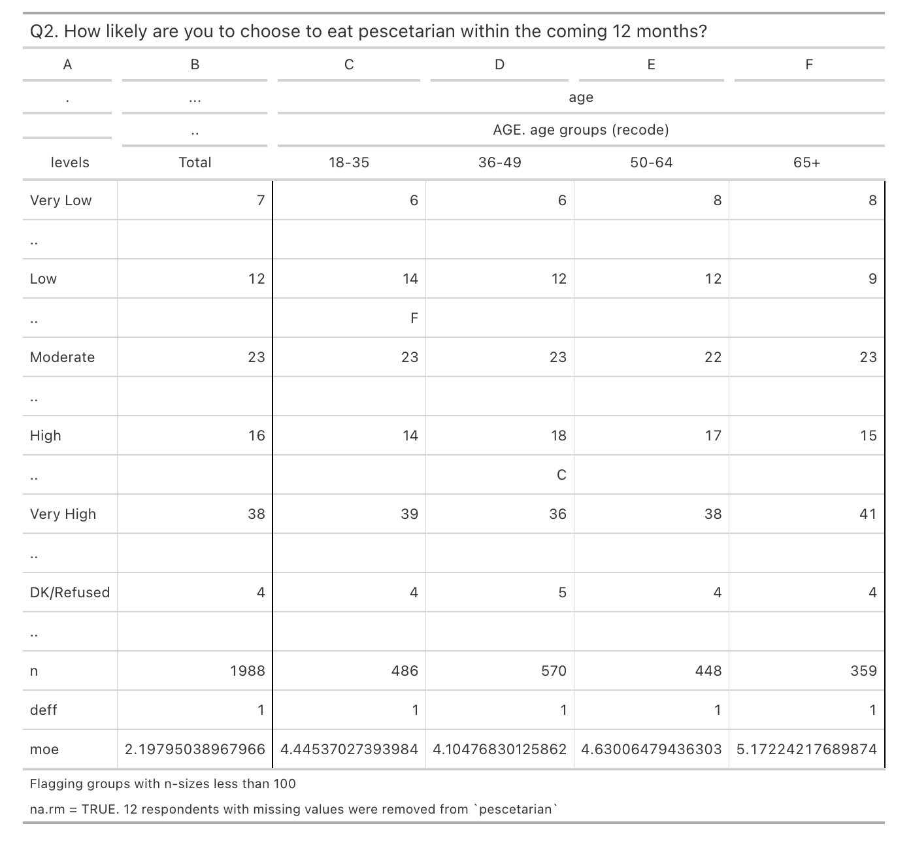

<!-- README.md is generated from README.Rmd. Please edit that file -->

# wink <a href="https://jjmoncus.github.io/wink/"></a>

`wink` helps you make crosstabs and banners of survey estimates, with
significance testing built in.

<!-- badges: start -->

<!-- badges: end -->

## Overview

A banner is a set of crosstabs of survey estimates stitched together,
with significance testing performed column-by-column within each
crosstab.

``` r
banner(
  data = food,
  var = "pescetarian",
  bys = "age"
)
```



As you add more variables to split by, each new crosstab is added on the
end, without disrupting the significance testing results of previous
ones.

`wink` provides functionality for generating these banners, specific to
each organization’s unique preferences, before exporting to a common
output format (Excel) for sharing across research teams.

## Installation

You can install the development version of wink from [the GitHub
rep](https://github.com/jjmoncus/wink/) with:

``` r
# library(devtools)
install_github("jjmoncus/wink", 
               build_vignettes = TRUE, # helpful to see vignettes, set to FALSE if needed
               force = TRUE  # helpful if you've installed previous versions, forces an override, set to FALSE if needed
                         )
```

## Usage

See `vignette("wink")` for an intro to the package, or visit the [Get
Started](https://jjmoncus.github.io/wink/articles/wink.html) link on the
[website](https://jjmoncus.github.io/wink/index.html).

For questions, reach out to J.J. Moncus at <jjmoncus706@gmail.com>, or
[raise an issue](https://github.com/jjmoncus/wink/issues).
